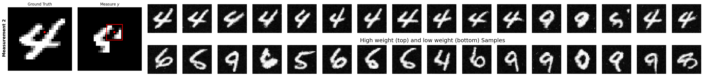

Code repository for the paper [Bayesian Experimental Design via Contrastive Diffusions](https://arxiv.org/abs/2410.11826v1)

# Structure of the repository:

- `diffuse/`: contains the source code of the Diffuse tool with the following files:
    - `mixtures.py`: contains the implementation of the mixture models for the test of toy diffusion
    - `sde.py`: Implementation of the Lin stochastic differential equations and its reverse-time counterpart used for sampling
    - `image.py`: tools for image processing and masking for MNIST
    - `score_matching.py`: implementation of the score matching loss used to train Diffusion Model
    - `unet.py`: implementation of the U-Net architecture used for the Diffusion Model
    - `mnist_train.py`: script to train the Diffusion Model on MNIST
    - `conditional.py`: implementation of the conditional sampling procedure


- `examples/`: contains the examples of use of the Diffuse tool with a test on a toy example with Gaussian Mixtures
    - `design_mnist.py`: script to run the design optimization on handwritten digits retrieval
    - `mixture_evolution.py`: plot evolution of the mixture models with noising and denoising process
- `test/`: contains the tests for the Diffuse tool with a test on a toy example with Gaussian Mixtures

# Visualization of the design optimization procedure:
<p align="center">
  
  
  
  
  
  
</p>

**Figure:** Image reconstruction. First 6 experiments (rows): image ground truth, measurement at experiment $k$, samples from current prior $p(\theta|\mathcal{D}_{k-1}) $, with best (upper) and worst (lower) weights in each sub-row. The samples incorporate past measurement information as the procedure advances.

# Comparison with random measurements:
<p align="center">
  
  
  
  
</p>

**Figure:** Optimized vs. random designs: measured outcome $y$ (2nd vs. 3rd column) and parameter $\theta$ estimates (reconstruction) with highest weights (upper vs. lower sub-row).


Forward / Reverse process diffusion process on mixtures:
<p align="center">
  
  
</p>

For tests and plots of the diffusion on mixture of Gaussians:
```bash
pytest --plot
```
